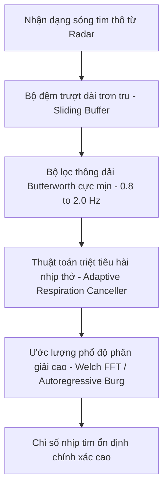

# BÁO CÁO NGHIÊN CỨU & PHÂN TÍCH ĐỘ CHÍNH XÁC NHỊP TIM (ACCURACY RESEARCH REPORT)

Báo cáo này phân tích chi tiết nguyên nhân hiện tượng sai lệch khoảng **10 BPM** giữa kết quả đo nhịp tim bằng radar mmWave (IWR6843AOP) so với đồng hồ thông minh (Smartwatch) và đề xuất các giải pháp kỹ thuật cụ thể.

---

## I. PHÂN TÍCH NGUYÊN NHÂN & LÝ DO (ROOT CAUSES)

Sự chênh lệch nhịp tim giữa hai thiết bị đến từ 4 nhóm nguyên nhân cốt lõi sau:

### 1. Khác biệt về Nguyên lý Sinh lý học (Physiological Principle Difference)
* **Đồng hồ thông minh (PPG - Photoplethysmography)**: Đo quang học sự thay đổi thể tích máu trong các mao mạch ở cổ tay. Chỉ số này phản ánh **sóng mạch ngoại vi**. Smartwatch luôn áp dụng các bộ lọc làm mịn rất lớn (cửa sổ trượt từ 15 đến 30 giây) để loại bỏ nhiễu cử động tay, dẫn đến độ trễ phản hồi rất cao.
* **Radar mmWave (BCG/SCG - Ballistocardiography/Seismocardiography)**: Đo vi dịch chuyển cơ học trực tiếp của thành ngực do sự co bóp quả tim (biên độ cực nhỏ chỉ từ $0.01 - 0.2$ mm). Đây là phép đo **động lực học trung tâm** thời gian thực.
* **Độ lệch pha tự nhiên**: Sóng áp lực từ tim mất một khoảng thời gian truyền đến cổ tay (gọi là *Pulse Transit Time - PTT*). Khi nhịp tim biến động nhanh, nhịp tim trung tâm (radar) sẽ thay đổi trước nhịp tim ngoại vi (smartwatch).

### 2. Hiện tượng Hài nhịp thở lấn át nhịp tim (Respiration Harmonics Leakage)
* Đây là nguyên nhân kỹ thuật phổ biến nhất. Biên độ dịch chuyển ngực do thở ($1 - 12$ mm) lớn gấp **100 đến 1000 lần** so với dịch chuyển do tim đập ($0.01 - 0.2$ mm).
* Do đó, các **hài bậc cao của nhịp thở** (ví dụ hài bậc 3, bậc 4, bậc 5) có năng lượng rất mạnh và thường rơi đúng vào dải tần số của nhịp tim ($0.8 - 2.5$ Hz, tương đương $48 - 150$ BPM).
* *Ví dụ thực tế*: Nếu đối tượng thở ở tần số 15 nhịp/phút ($0.25$ Hz), hài bậc 4 của nhịp thở sẽ nằm ở $1.0$ Hz ($60$ BPM) và hài bậc 5 ở $1.25$ Hz ($75$ BPM). Nếu thuật toán tách lọc pha (on-chip DSP) lọc không triệt để, bộ phân tích phổ FFT sẽ bị "hấp dẫn" và khóa nhầm vào đỉnh hài nhịp thở này thay vì đỉnh nhịp tim thực tế, gây ra sai lệch cố định khoảng $5 - 15$ BPM.

### 3. Hạn chế độ phân giải tần số FFT (Frequency Bin Resolution Limit)
* Thuật toán gốc của TI xử lý phổ FFT trên cửa sổ thời gian $T = 15$ giây.
* Độ phân giải tần số của FFT được tính bằng:
  $$\Delta f = \frac{1}{T} = \frac{1}{15} \approx 0.067 \text{ Hz}$$
* Đổi sang đơn vị nhịp/phút (BPM):
  $$\Delta \text{BPM} = 0.067 \times 60 \approx 4 \text{ BPM}$$
* Điều này nghĩa là các bin tần số của FFT cách nhau cố định khoảng **4 BPM** (ví dụ: ..., 60, 64, 68, 72, 76, ...). Nếu nhịp tim thực tế là 70 BPM (nằm giữa hai bin), thuật toán FFT đơn giản sẽ làm tròn về 68 hoặc 72, tạo ra sai số lượng tử tự nhiên từ $\pm 2$ đến $\pm 4$ BPM.

### 4. Hướng đặt cảm biến và Nhiễu động cơ thể (Sensor Alignment & Motion Artifacts)
* **Đặt lệch góc**: Chùm sóng radar cần hướng thẳng góc $90^\circ$ vào vùng ngực. Nếu đặt radar quá thấp hướng vào bụng, tín hiệu nhận được sẽ bị thống trị bởi nhịp thở của cơ hoành, làm triệt tiêu tín hiệu tim.
* **Micro-movements**: Swallowing (nuốt), gõ bàn phím, hay nói chuyện tạo ra các dịch chuyển lớn gấp hàng chục lần nhịp tim, gây méo mó nghiêm trọng tín hiệu pha và làm thuật toán ước lượng nhịp tim bị sai lệch.

---

## II. ĐỀ XUẤT CÁC PHƯƠNG PHÁP GIẢI QUYẾT (SOLUTIONS & METHODS)

Để giải quyết triệt để vấn đề này, chúng ta cần triển khai giải pháp đồng bộ ở cả 3 lớp: Lắp đặt vật lý, Cấu hình Radar và Thuật toán xử lý tín hiệu GUI.

### Lớp 1: Căn chỉnh & Lắp đặt Vật lý (Physical Alignment) - *Thực hiện ngay*
1. **Định vị cảm biến**: Đặt radar cao đúng bằng tầm ngực của đối tượng (khoảng $1.0 - 1.2$ mét từ mặt đất khi ngồi). Hướng mặt anten phẳng song song và vuông góc với lồng ngực.
2. **Khoảng cách tối ưu**: Ngồi ổn định ở khoảng cách $1.0 - 1.5$ mét trước radar (phù hợp nhất với profile cấu hình chirp cự ly gần).
3. **Môi trường tĩnh**: Đối tượng cần ngồi yên lặng, không nói chuyện, không chuyển động tay chân trong quá trình đo.

### Lớp 2: Tối ưu hóa Cấu hình Radar (Radar Configuration Tuning) - *Thực hiện ngay*
* **Tăng số điểm FFT tích lũy**: Thay đổi cấu hình `vitalsign 15 300` trong file `.cfg` lên `vitalsign 15 512` hoặc `vitalsign 20 600`.
  * *Tác dụng*: Việc tăng độ dài cửa sổ tích lũy dữ liệu giúp tăng độ phân giải tần số của thuật toán FFT lên mức cực mịn (dưới $1.5$ BPM).

### Lớp 3: Nâng cấp thuật toán DSP thứ cấp trên GUI (Secondary GUI DSP Algorithms) - *Đề xuất phiên bản v1.2.0*
Thay vì tin tưởng tuyệt đối vào chỉ số nhịp tim thô tính sẵn từ chip, chúng ta sẽ thu thập **dạng sóng tim cơ học (`heart_waveform`)** truyền về và tự thực hiện bộ xử lý DSP chất lượng cao trong Python:

1. **Bộ lọc thông dải Butterworth bậc cao (Butterworth Bandpass Filter)**: Thay thế dải lọc thô bằng bộ lọc thông dải IIR Butterworth bậc 4 trong khoảng $0.8 - 2.0$ Hz để triệt tiêu toàn bộ tần số thấp của nhịp thở.
2. **Thuật toán ước lượng phổ độ phân giải cao Burg (Autoregressive - AR Burg Method)**: Thay thế FFT bằng phương pháp AR Burg để tìm đỉnh tần số. Phương pháp này có độ phân giải siêu cao ngay cả trên cửa sổ dữ liệu ngắn, loại bỏ hoàn toàn sai số lượng tử 4 BPM của FFT thông thường.
3. **Triệt tiêu hài nhịp thở thích ứng (Adaptive Respiration Harmonic Cancellation)**: Sử dụng dạng sóng nhịp thở thu được để làm tín hiệu tham chiếu nhiễu, chạy bộ lọc thích ứng LMS để trừ đi các hài bậc cao của nhịp thở ra khỏi dạng sóng tim.
