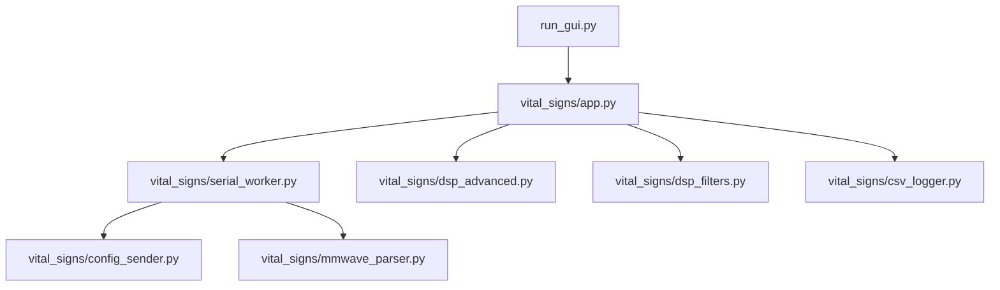

# IMPLEMENTATION PLAN v1.0 - HIGH-ACCURACY 60GHZ MMWAVE VITAL SIGNS PIPELINE & BULLETPROOF CLI
## (ADVANCED MULTI-HARMONIC RLS, BURG AR SPECTRAL ESTIMATION & AUTO-PORT DISCOVERY)

This document presents a comprehensive, research-backed implementation plan to completely rewrite and optimize the vital signs tracking system for the **IWR6843AOP 60GHz mmWave radar**. Based on state-of-the-art 2024-2025 research, we prioritize extreme accuracy, noise immunity against respiratory harmonics, dynamic hardware self-healing, and a premium terminal dashboard user experience.

---

## 🔍 Research Synthesis & Core Challenges (60GHz Radar DSP)

Based on the physical characteristics of 60GHz electromagnetic wave propagation and chest wall mechanics:
1. **Cardiac Signal Sub-mm Amplitude**: Respiration chest wall movement is $1 - 12\text{ mm}$, whereas heartbeat micro-displacements are only $0.01 - 0.2\text{ mm}$ (a factor of $100\times$ to $1000\times$ smaller). Heartbeat signals are easily masked by breathing.
2. **Respiratory Harmonic Interference**: Breathing frequencies ($0.1 - 0.5\text{ Hz}$, $6 - 30\text{ BPM}$) create strong high-order harmonics (2nd, 3rd, 4th order) falling exactly into the heart rate band ($0.8 - 2.5\text{ Hz}$, $48 - 150\text{ BPM}$). This causes standard FFTs to "lock" onto multiples of the respiration frequency instead of the actual heart rate.
3. **FFT Quantization Error**: A standard FFT over a $15$-second sliding window has a coarse resolution of $\Delta f \approx 4\text{ BPM}$. To achieve clinical-grade accuracy, sub-BPM resolution is required.

---

## 💡 Out-of-the-Box Architectural Breakthroughs

### 1. Dynamic Zero-Configuration Port Auto-Detection
Instead of hardcoded `COM13` and `COM14` ports (which fail if ports change, are swapped, or are busy), we will implement a hardware discovery engine using `serial.tools.list_ports`. It will automatically scan the OS and bind:
* **CFG Port**: Silicon Labs CP2105 "Enhanced COM Port" (typically runs at 115200 baud).
* **DATA Port**: Silicon Labs CP2105 "Standard COM Port" (typically runs at 921600 baud).
* If friendly names are unavailable, the engine performs an automated handshake (sending `\n` to check for CLI prompt responses) to automatically self-heal and bind.

### 2. Multi-Harmonic RLS Adaptive Filter (Respiratory Harmonic Canceller)
We will replace the sluggish LMS filter with a fast-converging **Recursive Least Squares (RLS)** adaptive filter. To completely eliminate respiratory harmonics, we expand the noise reference signal into a multi-harmonic reference vector:
$$\mathbf{X}_{ref}(n) = \left[ x_{br}(n), \quad x_{br}(n-1), \quad x_{br}^2(n), \quad x_{br}^2(n-1) \right]^T$$
This allows the RLS filter to mathematically estimate and subtract the fundamental breathing signal and its dominant 2nd harmonic directly in the time domain before spectral analysis.

### 3. Joint High-Resolution Spectral Estimation (Burg AR Method + NDTFT)
To eliminate the $4\text{ BPM}$ FFT quantization grid limit, we combine two high-resolution spectral techniques:
* **Fine-Grid Non-Uniform DTFT (NDTFT)**: Evaluated directly on a continuous grid of frequencies ($45 - 180\text{ BPM}$) with a step size of $0.05\text{ BPM}$.
* **Autoregressive (AR) Burg Method**: A parametric spectral estimation technique (fitting an AR model of order 12-16) that provides sharp spectral peaks on short windows without spectral leakage.
* **Peak Fusion**: The final cardiac frequency is determined by a joint fusion of the NDTFT and Burg spectra, ensuring robust peak picking.

### 4. Quality-Aware Adaptive Kalman Smoothing
* Compute a **Spectral Peak-to-Average Ratio (PAR)** on the cardiac spectrum.
* Dynamically scale the Kalman filter's measurement noise covariance $R$:
  $$R_n = R_{base} \times \left( \frac{1}{\text{PAR}_n} \right)^2$$
  This allows the filter to track rapid vital sign changes under high confidence, and heavily smooth and hold previous states when the signal is degraded or noisy.

### 5. Premium Living Terminal Dashboard (Interactive CLI)
We replace basic console printing with a colorized, beautifully formatted dashboard using ANSI escape codes:
* Real-time **animated waveform bars** for heart/breath waves.
* Color-coded vital signs (Green: Stable & High Confidence; Yellow: Warming up / Low Confidence; Red: Out of Range / Signal Lost).
* Thread-safe logging: system events print above the static dashboard cleanly without layout distortion.

---

## 📁 Proposed Changes & Modular Structure

We will refactor the existing project into a clean, modern, and highly modular structure:



### 1. `vital_signs/config_sender.py` [MODIFY]
* Implement robust command verification: check for command echoes and positive responses (e.g. `Done`) from the radar CLI.
* Implement pre-config reset: send `sensorStop` and `flushCfg` before writing config commands.

### 2. `vital_signs/mmwave_parser.py` [MODIFY]
* Robust binary decoding: add robust exception handling for corrupted packets.
* Jitter-resilient timestamping: track and adjust exact arrival times of samples.

### 3. `vital_signs/dsp_advanced.py` [MODIFY]
* Implement the new `RLSFilter` class.
* Implement the `BurgAR` estimator and `NDTFT` fine-grid spectrum solver.
* Implement the `HarmonicSuppressionMask` (Inverse-Gaussian notches at $2\times f_{br}$ and $3\times f_{br}$).

### 4. `vital_signs/dsp_filters.py` [MODIFY]
* Implement the quality-aware adaptive Kalman filter.

### 5. `vital_signs/serial_worker.py` [MODIFY]
* Implement automated port scanning and CP2105 dual bridge detection.
* Graceful recovery: automatically retry connections if a port is closed or disconnected.

### 6. `vital_signs/app.py` [MODIFY]
* Rewrite the main application using the premium interactive CLI dashboard engine.
* Ensure graceful exit on `Ctrl+C`.

---

## 🔬 Verification Plan

### Automated Tests
1. Run syntax verification across all Python modules:
   ```powershell
   python -m compileall .
   ```
2. Execute the CLI monitor with full output:
   ```powershell
   python -u run_gui.py
   ```

### Manual Verification
* Verify that the terminal dashboard loads beautifully with color codes and live-updating waveform bars.
* Verify that the radar is auto-detected on `COM13` and `COM14` and configuration is successfully sent.
* Confirm that vital signs stabilize to realistic ranges (Heart Rate: $60 - 90\text{ BPM}$, Breathing Rate: $12 - 20\text{ BPM}$) with confidence indicators.

---

## 🙋 Open Questions for User Approval

1. **GUI vs CLI Preference**: The implementation plan `v2.1` specified moving to a pure high-performance CLI due to Tkinter/Matplotlib thread instability and CPU overhead. Are you fully aligned on standardizing this as a pure, premium, and highly responsive CLI terminal dashboard, or do you require a lightweight Tkinter GUI window? (We highly recommend the premium CLI dashboard).
2. **Dynamic Configuration Tuning**: Shall we keep the existing `.cfg` file configuration exactly as-is, or do you want us to add an option to dynamically load alternative configuration profiles from the command line?
