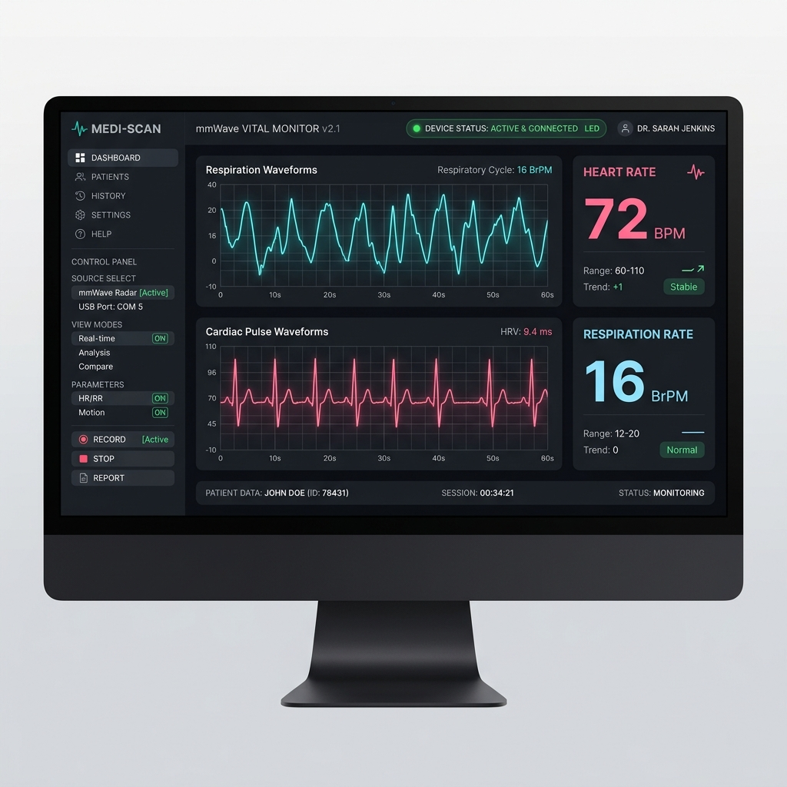

# Implementation Plan - Version 1: Advanced Filtering, Noise Reduction & Real-time GUI

This document outlines the detailed specifications and technical parameters for **Version 1** of the mmWave Vital Signs application.

---

## 1. Filter Research & Specifications

To isolate nhịp thở (breathing rate) and nhịp tim (heart rate) from the 60 GHz radar phase reflections, the following filters are selected:

### A. Respiration Extraction Filter
*   **Filter Type**: 2nd-order Butterworth IIR Bandpass
*   **Frequency Band**: 0.1 Hz to 0.5 Hz (equivalent to 6 to 30 breaths/min)
*   **Justification**: Respiration chest movement is relatively large (1–12 mm). A 2nd-order Butterworth filter provides a flat response in the passband, ensuring the waveform shape is preserved with minimal phase distortion.

### B. Cardiac Extraction Filter
*   **Filter Type**: 4th-order Chebyshev Type II or Butterworth IIR Bandpass + **Adaptive RLS (Recursive Least Squares) Filter**
*   **Frequency Band**: 0.8 Hz to 2.0 Hz (equivalent to 48 to 120 BPM)
*   **Justification**: 
    1. Heartbeat micro-motion is extremely small (0.1–0.5 mm).
    2. Respiration harmonics (e.g., 2nd harmonic at 0.8 Hz, 3rd at 1.2 Hz) directly overlap with the heart rate band and can be 10x stronger than the actual heartbeat.
    3. An **Adaptive RLS Filter** uses the filtered respiration waveform as a noise reference, dynamically modeling and subtracting respiration harmonics from the cardiac signal to isolate the true heartbeat.

### C. Temperature Monitoring
*   **Silicon Junction Temperature**: The IWR6843AOP cannot measure body temperature via radar. However, we can track the radar's internal silicon junction temperature via the BSS thermal sensors using mmWave Link APIs (e.g., `rlSensorTemperatureRead`) to monitor sensor health and prevent thermal calibration drift.
*   **Human Body Temperature**: Requires interfacing an external sensor (e.g., MLX90614 infrared thermopile via I2C) to the PC host.

---

## 2. Advanced Noise Reduction Pipeline

The following steps are designed to minimize ambient noise:

1.  **Static Clutter Subtraction**:
    Subtract the exponential moving average of the complex range profile. This filters out static reflections from walls, furniture, and clothing, amplifying the target's relative movements.
2.  **Phase Unwrapping**:
    Since phase is bounded in $[-\pi, \pi]$, chest displacements exceeding $\lambda/4 \approx 1.25\text{ mm}$ cause $2\pi$ phase wrapping. The unwrapper dynamically adds/subtracts $2\pi$ when phase steps exceed $\pi$ radians.
3.  **Motion Gating**:
    Large body movements swamp micro-motion signals. By calculating the variance of the range profile amplitude over a short window, macro-motion is detected. When active, the BPM estimation is **frozen** to prevent invalid rate spikes.

---

## 3. UI Dashboard Layout Specification

The dashboard will be built using Python's standard `tkinter` library and `matplotlib` for plotting, employing a medical-grade dark theme (Catppuccin Mocha themed).

### Dashboard Layout & Controls
*   **Sleek Dark Theme**: Background color `#1e1e2e` with card container backgrounds `#181825` and white/sky-blue text labels.
*   **Controls Sidebar (Left)**:
    *   Dropdown COM port selectors for CLI and DATA.
    *   Config file path selector.
    *   Start/Stop monitoring button.
    *   Record CSV checkbox.
*   **Digital Metrics Display (Top)**:
    *   **Heart Rate Display**: Glowing pink text, displaying current BPM and Kalman confidence.
    *   **Respiration Rate Display**: Glowing sky-blue text, displaying current BPM.
    *   **Distance & Temp**: Displays subject distance (meters) and internal chip temperature (°C).
*   **Real-time Graphs Grid (Right)**:
    *   **Graph 1**: Scrolling respiration waveform (turquoise).
    *   **Graph 2**: Scrolling cardiac pulse waveform (pink).
    *   **Graph 3**: Historical trends showing HR and BR over the last 5 minutes.

### UI Mockup Visual Reference
The visual layout of the GUI dashboard is saved in the docs directory:

---

## 4. Execution Rules
*   **Code Freeze**: All Python files in the workspace (inside `vital_uart/` and the root directory) are kept in their original states.
*   No code will be modified or executed until explicit user permission is received.
